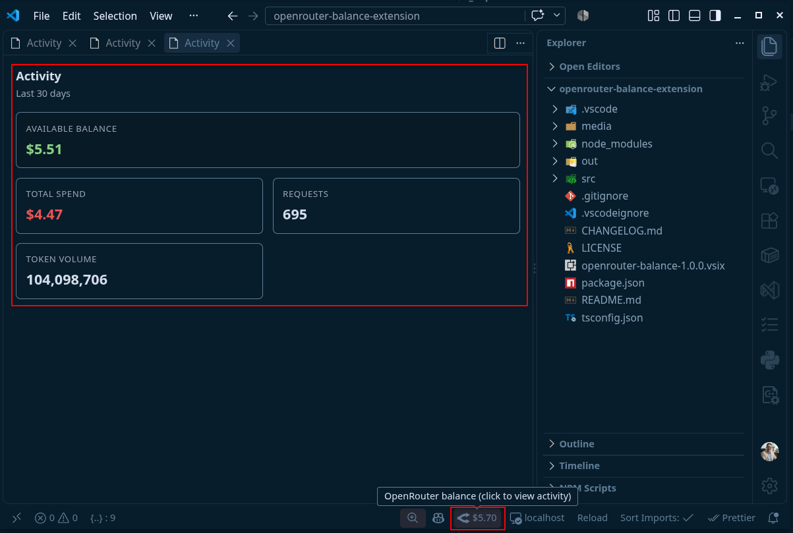

# OpenRouter Balance

A VS Code extension that displays your **OpenRouter account balance** in the
status bar and, when clicked, shows **account activity** (spend, requests, token
volume, and available balance).



## Features

- Shows the balance in the status bar (on the **right**) with the **official
  OpenRouter icon** and the value in **US dollars** (`$`/`US$` depending on the
  language).
- Color-coded indicator based on the balance: green (normal), amber (low), and
  red (critical), configurable.
- Clicking the indicator opens a panel with the **account activity** (total
  spend, requests, token volume, and available balance), equivalent to the
  OpenRouter `/activity` page.
- The key is stored securely in the operating system keychain (VS Code
  `SecretStorage`) and is never written in plain text.

## Prerequisites

- An OpenRouter **management key**, created at
  <https://openrouter.ai/settings/management-keys> (format `sk-or-v1-...`).
- The management key is required because the balance endpoint
  (`GET /api/v1/credits`) and the activity endpoint (`POST /api/v1/analytics/query`)
  require administrative permissions.

## Installation and usage

1. Install the extension.
2. Open the command palette (`Ctrl+Shift+P` / `Cmd+Shift+P`) and run
   **"OpenRouter: Set management key"**.
3. Paste your management key. It is saved to the secure keychain.
4. The balance appears in the status bar and is updated periodically.

### Available commands

| Command | Description |
| --- | --- |
| `OpenRouter: Set management key` | Configures the management key. |
| `OpenRouter: Clear management key` | Removes the stored key. |
| `OpenRouter: Show activity` | Opens the activity panel. |
| `OpenRouter: Refresh balance now` | Forces an immediate refresh. |

## Configuration

| Property | Default | Description |
| --- | --- | --- |
| `openrouter.refreshIntervalMinutes` | `15` | Interval (minutes) between checks. |
| `openrouter.lowBalanceThreshold` | `5` | Threshold (USD) for the amber balance. |
| `openrouter.criticalBalanceThreshold` | `1` | Threshold (USD) for the red balance. |

## Key security

The management key is stored in the VS Code **SecretStorage** (operating system
keychain/credential store). This **prevents technical leakage** of the key
(plain-text files, accidental Git commits, distribution inside the `.vsix`
package).

⚠️ **Important limitation:** SecretStorage does **not** prevent human leakage. If
you share the key manually, it will be exposed. Best practices:

- **Never** share your management key.
- To grant access to others, generate a separate, limited key.
- Revoke any suspicious key immediately at
  <https://openrouter.ai/settings/management-keys>.

## About the activity

The activity is fetched **online** from the official analytics endpoint
`POST /api/v1/analytics/query`, returning the aggregated account totals for the
**last 30 days**: total spend (USD), request count, and token volume. The balance
comes from `GET /api/v1/credits`.

> The OpenRouter API does not expose an endpoint to list individual generations;
> the analytics endpoint provides the official aggregated activity data and
> requires a management key.

## Development

```bash
npm install        # install dependencies
npm run compile    # compile TypeScript
npm test           # run unit tests
```

To debug: press `F5` (Extension Development Host).

## Publishing

```bash
npm install -g @vscode/vsce
vsce package          # generates the .vsix file
vsce publish          # publishes to the Marketplace
```

## License

MIT
